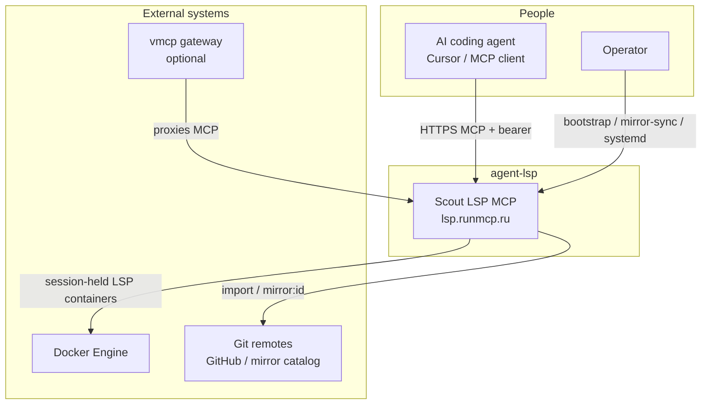
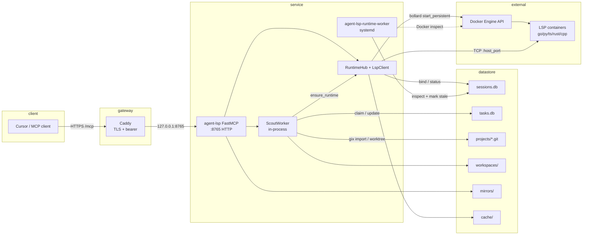
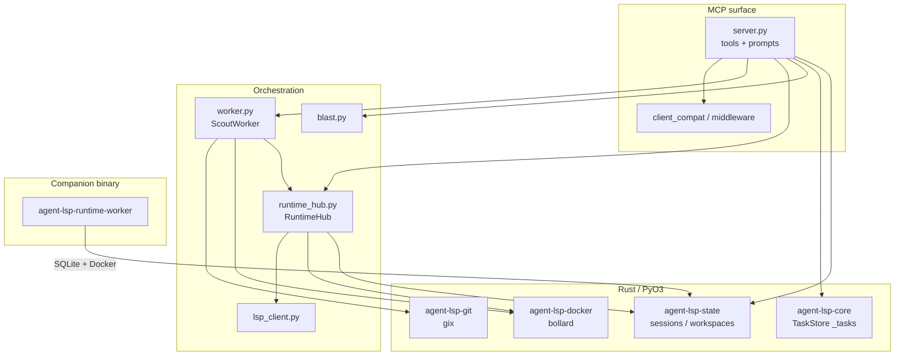

# C4 model — agent-lsp

C4 views for the scout LSP MCP stack. Levels follow
[C4 model](https://c4model.com/) (Context → Container → Component).

> **Note:** FigJam `generate_diagram` does **not** support Mermaid `C4Context` /
> `C4Container`. These diagrams use standard Mermaid `flowchart` so they render
> in GitHub and editors. Treat subgraphs as C4 boundaries.

Related: [OVERVIEW.md](OVERVIEW.md) · [ADL](../adr/README.md)

---

## Level 1 — System Context

Who uses agent-lsp, and what systems it talks to.



**Intent:** agents get hover / definition / references / blast_radius over real
trees without a local IDE. Operators sync heavy mirrors and keep the host healthy.

---

## Level 2 — Containers

Deployable / runnable units on the host (prod: `infra/deploy`).



| Container | Process | Notes |
|-----------|---------|--------|
| FastMCP | `agent-lsp.service` | MCP tools + prompts; wakes ScoutWorker |
| ScoutWorker | same process | SQLite task loop (`worker.py`) |
| Runtime health worker | `agent-lsp-runtime-worker.service` | ADR-0012; dead Docker → `stale` |
| Caddy | edge | `infra/deploy/caddy/Caddyfile` |
| LSP containers | Docker | ADR-0007 session-held |

---

## Level 3 — Components (inside agent-lsp)

Packages and major modules inside the FastMCP process + companion binaries.



| Component | Path | Role |
|-----------|------|------|
| FastMCP tools | `python/agent_lsp/server.py` | MCP API |
| ScoutWorker | `python/agent_lsp/worker.py` | Long tasks |
| RuntimeHub | `python/agent_lsp/runtime_hub.py` | Session → LSP client |
| LspClient | `python/agent_lsp/lsp_client.py` | JSON-RPC TCP/stdio |
| TaskStore | `src/lib.rs` → `_tasks` | `tasks.db` |
| StateStore | `packages/agent-lsp-state` | `sessions.db` |
| Git | `packages/agent-lsp-git` | bare + worktree |
| Docker | `packages/agent-lsp-docker` | persistent LSP |
| Health worker | `packages/agent-lsp-runtime-worker` | reconcile |

---

## Key flows

### Onboard → scout

```text
create_session
  → import_project(task)     # gix → projects/<id>.git
  → checkout_workspace       # workspaces/<wid>
  → ensure_runtime(task)     # Docker LSP + RuntimeHub
  → warm_index(task)         # index_status=ready
  → explore_symbol / blast_radius / …
```

### Runtime health (half-open TCP / dead container)

```text
runtime-worker: Docker Running? → else sessions stale
HUB / scout: is_running + transport_alive?
  → Broken pipe / dead TCP → runtime_stale + needs_recycle
  → client: ensure_runtime + warm_index
```

---

## Deploy shape (prod)

```text
Internet → Caddy :443 (bearer)
         → agent-lsp :8765
         → Docker LSP containers (127.0.0.1:ephemeral→3737)
         → agent-lsp-runtime-worker (poll sessions.db)
Data: /var/lib/agent-lsp/{state,projects,workspaces,mirrors,cache}
```

See `infra/deploy/README.md`.
